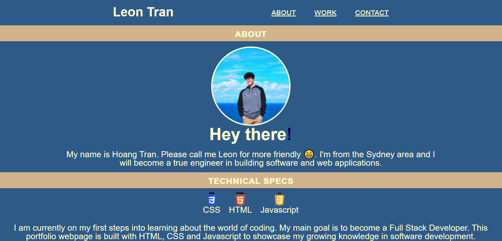
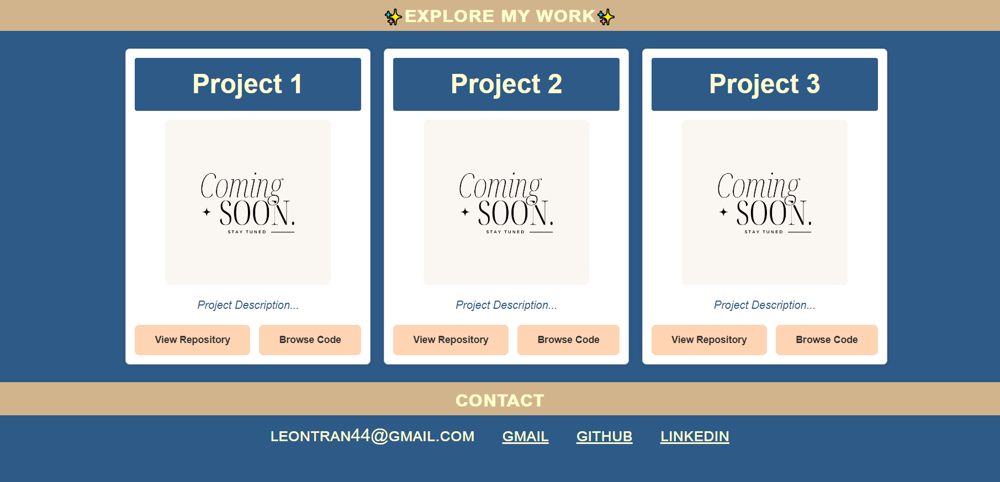
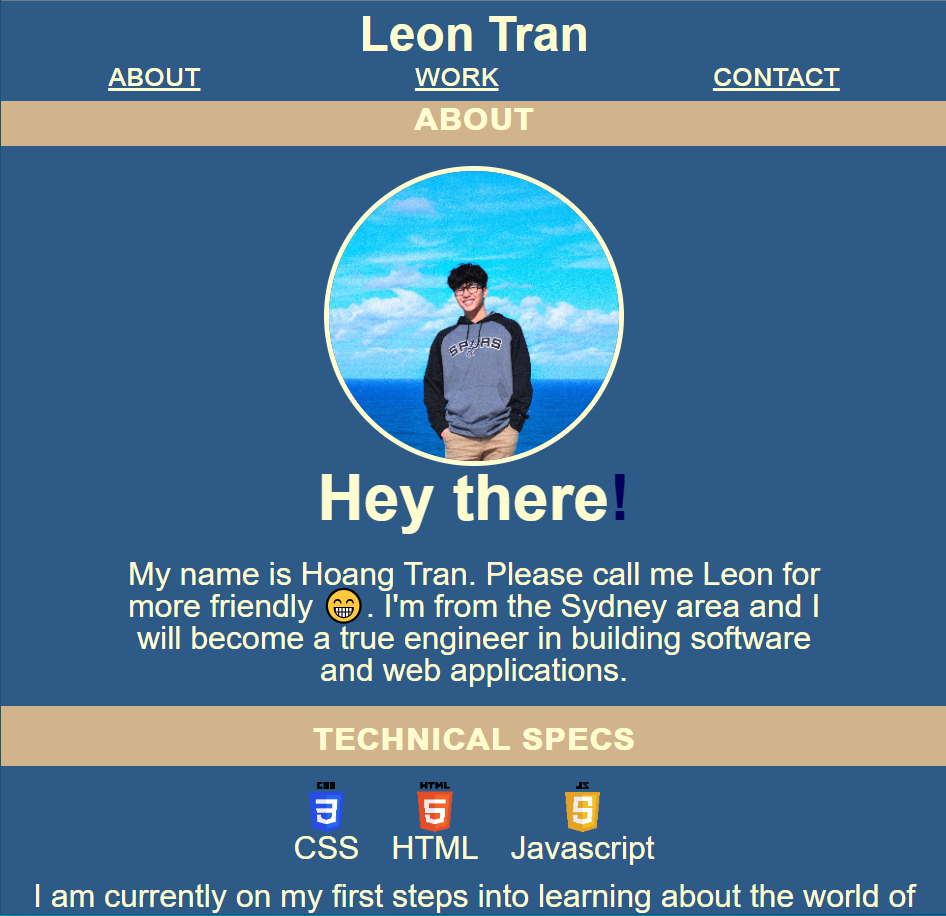
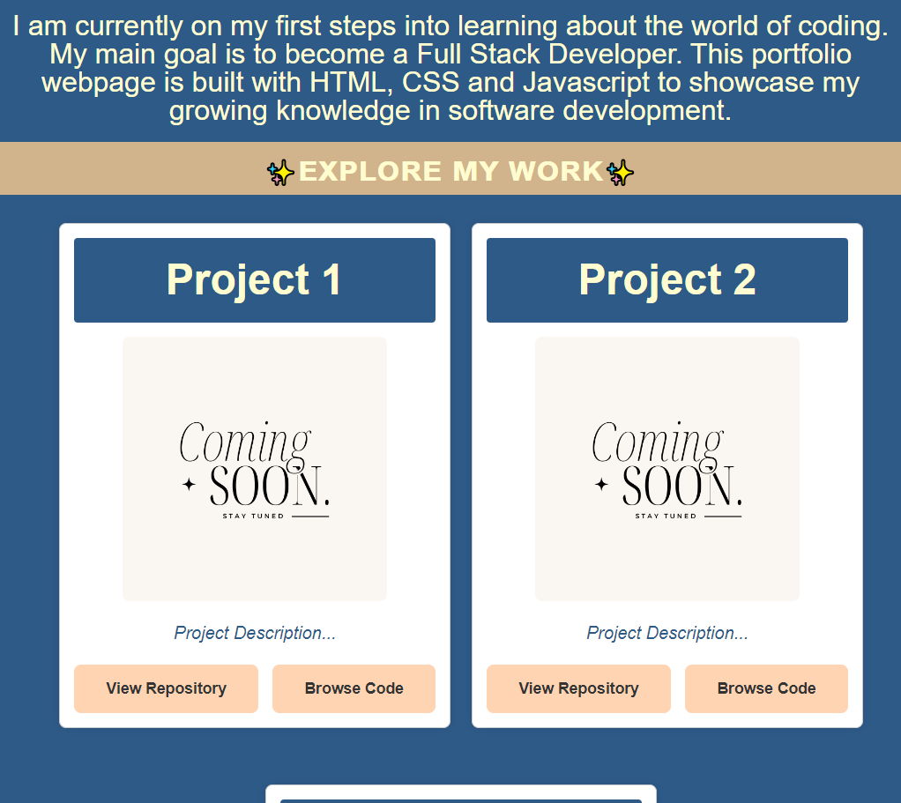
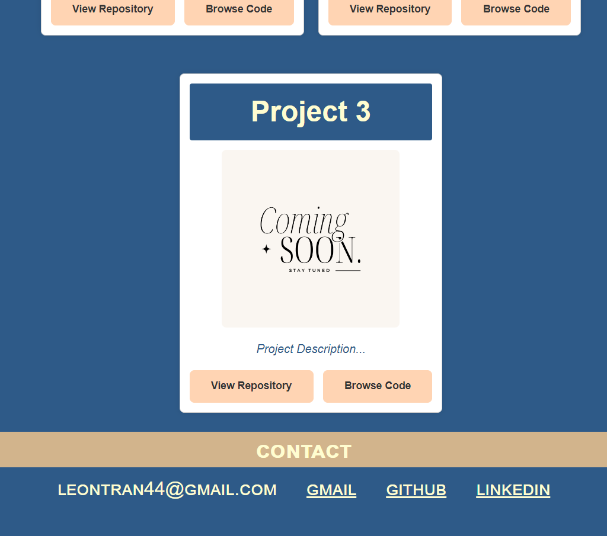

# Portfolio

**[Preview My Portfolio's Webpage](https://leontran44.github.io/leon-module-02-challenge/)**

  
  
  

## Description

This is my first portfolio created as for Challenge 2 Bootcamp Coding using HTML and CSS.

## Final Product

In full Screen (More than 980px)

Below 980px:

## Table of Contents
* [Usage](#usage)
* [License](#license)
* [Contact](#contact)

## Usage

1. Access the HTML source code through the repo or within a Chromium/Firefox browser by pressing `F12` or `Control+Shift+I` (Windows) or `Command+Option+I` (MacOS). 

2. The user can navigate to the three sections of the webpage (About, Work, and Contact) by using links in the navigation bar located at the top of the page. Project images link to work examples when clicked. Links in the contact section take you to the corresonding websites (Gmail, GitHub, and LinkedIn).

## Credits

Credits to [USYD Bootcamp](https://techbootcamp.sydney.edu.au/coding/)
## License

[MIT License](https://opensource.org/licenses/MIT)

## Contact

* Email tranhoangquan44@gmail.com
* LinkedIn [https://www.linkedin.com/in/hoangqtran/](https://www.linkedin.com/in/hoangqtran/)
